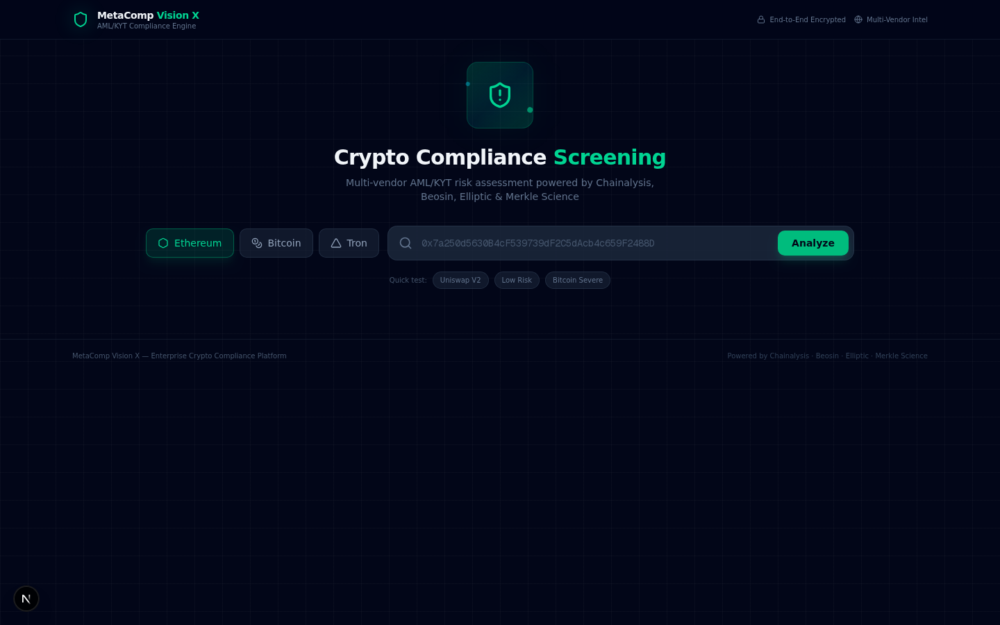
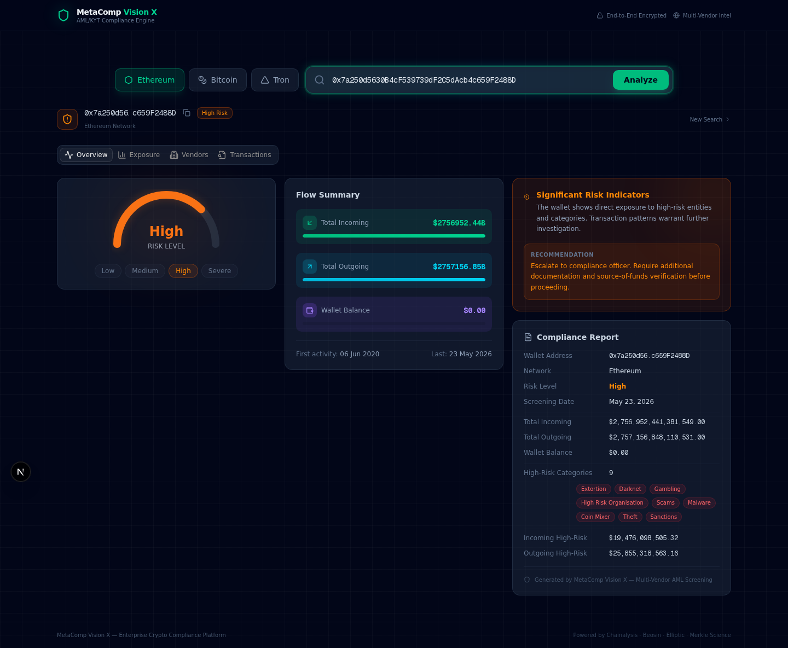

# MetaComp Vision X — Crypto Compliance Dashboard

<div align="center">



**Enterprise-grade AML/KYT compliance screening powered by multi-vendor blockchain intelligence**

[](https://nextjs.org/)
[](https://typescriptlang.org/)
[](https://metacomp.ai)
[](LICENSE)

</div>

---

## Overview

**Vision X** is a real-time crypto compliance dashboard that integrates the [MetaComp Vision X API](https://metacomp.ai/developers/skill) — a risk intelligence engine that aggregates signals from four leading on-chain analytics vendors simultaneously:

| Vendor | Specialization |
|--------|---------------|
| **Chainalysis** | Industry-standard blockchain analysis |
| **Beosin** | Smart contract security & KYT |
| **Elliptic** | Crypto risk scoring & compliance |
| **Merkle Science** | Transaction monitoring & forensics |

Instead of relying on a single source of truth, Vision X delivers a **cross-validated risk report** with per-vendor breakdowns and a unified compliance conclusion — all within a professional, dark-themed cybersecurity dashboard.



---

## Architecture

```
┌─────────────────────────────────────────────────┐
│                   Next.js 16 App                  │
│              (TypeScript + Tailwind CSS)          │
├─────────────┬───────────────────────────────────┤
│  Frontend   │         API Routes (/api/)          │
│             │                                     │
│  • Risk     │  /api/metacomp/wallet        ──┐   │
│    Gauge    │  /api/metacomp/transaction    ──┤   │
│             │                                 │   │
│  • Exposure │  Server-side proxy hides API   │   │
│    Charts   │  key from client-side code     │   │
│             │                                 ▼   │
│  • Vendor   │                         MetaComp API
│    Compare  │                     (metacomp.ai)
│             │                    ┌────────────────┐
│  • Flow     │                    │  /api/v1/      │
│    Summary  │                    │  walletCheck   │
│             │                    │  transaction   │
│  • Verdict  │                    │  Check         │
│             │                    └───┬────────┬───┘
└─────────────┴────────────────────────┘    │        │
                                   ┌────────┘        └────────┐
                              ┌────▼─────┐      ┌─────▼─────┐   ┌──────────┐
                              │Chainalysis│      │  Beosin   │   │ Elliptic │
                              └──────────┘      └───────────┘   └──────────┘
                                                                       │
                                                                  ┌────▼─────┐
                                                                  │ Merkle    │
                                                                  │ Science  │
                                                                  └──────────┘
```

---

## Key Features

### Wallet Risk Screening
Paste any Ethereum, Bitcoin, or Tron wallet address and receive an instant, multi-layered risk assessment:

- **Risk Score Gauge** — Animated semicircular gauge (Low / Medium / High / Severe)
- **Exposure Breakdown** — USD-value exposure across 9+ risk categories: Sanctions, Darknet, Scams, Coin Mixer, Extortion, Gambling, Theft, Malware, High Risk Organisations
- **Flow Analysis** — Total incoming, outgoing, and current balance with risk-weighted breakdowns
- **Transaction Timeline** — First and last transaction dates with full activity span

### Cross-Vendor Intelligence
Every check aggregates signals from **four independent analytics providers** simultaneously:

- Per-vendor risk assessment comparison
- Alert status tracking (direct alerts, severe alerts)
- High-risk category flag counts per vendor
- Unified consensus verdict

### Transaction KYT (Know Your Transaction)
Investigate individual transactions with full counterparty risk analysis:
- Transaction-level risk signals
- Counterparty wallet screening in parallel
- Asset and direction tracking (ETH, USDT, BTC, etc.)

### Professional Compliance Output
- Risk verdict cards with regulatory recommendations
- Structured compliance report summaries
- Copy-ready wallet addresses with truncation
- Responsive dark-theme UI optimized for analyst workflows

---

## Tech Stack

| Layer | Technology |
|-------|-----------|
| **Framework** | Next.js 16 (App Router) |
| **Language** | TypeScript 5 |
| **Styling** | Tailwind CSS 4 + shadcn/ui |
| **Icons** | Lucide React |
| **API** | MetaComp Vision X REST API |
| **Networks** | Ethereum, Bitcoin, Tron |

---

## Project Structure

```
src/
├── app/
│   ├── api/metacomp/
│   │   ├── wallet/route.ts          # Wallet security check proxy
│   │   └── transaction/route.ts     # Transaction security check proxy
│   ├── globals.css                  # Dark theme + animations
│   ├── layout.tsx                   # App metadata & providers
│   └── page.tsx                     # Main dashboard (single-page)
├── components/
│   ├── dashboard/
│   │   ├── NetworkSelector.tsx      # ETH/BTC/TRON toggle
│   │   ├── WalletSearch.tsx         # Address input + validation
│   │   ├── RiskGauge.tsx            # SVG semicircular risk gauge
│   │   ├── ExposureChart.tsx        # CSS bar charts by category
│   │   ├── FlowSummary.tsx          # Incoming/outgoing/balance
│   │   ├── VendorComparison.tsx     # 4-vendor comparison grid
│   │   ├── TransactionSearch.tsx    # Transaction KYT input form
│   │   ├── TransactionTimeline.tsx  # Transaction timeline
│   │   ├── RiskVerdict.tsx          # Risk verdict + recommendation
│   │   └── ComplianceReport.tsx     # Compliance report card
│   └── ui/                          # shadcn/ui components
├── hooks/
│   ├── use-toast.ts
│   └── use-mobile.ts
└── lib/
    ├── metacomp.ts                  # API types + utility functions
    └── utils.ts                     # General utilities
```

---

## Getting Started

### Prerequisites
- Node.js 22+
- MetaComp API key ([apply at metacomp.ai](https://metacomp.ai))

### Installation

```bash
# Clone the repository
git clone https://github.com/icohangar-ops/metacomp-visionx-dashboard.git
cd metacomp-visionx-dashboard

# Install dependencies
npm install

# Configure environment (see .env.example)
cp .env.example .env.local
```

### Configure Environment Variables

Secrets are read server-side from environment variables — never hardcode them in source. Set the following in `.env.local` (and in your deployment's secret store for production):

```bash
# MetaComp Vision X API key (server-side only; never exposed to the browser)
METACOMP_API_KEY=your-metacomp-api-key

# Shared secret callers must send as the x-proxy-secret header to reach
# the /api/metacomp/* proxy routes. The proxy fails closed if this is unset.
PROXY_API_SECRET=your-proxy-secret
```

> Both values are stored server-side only and are never exposed to the browser. The proxy routes (`src/app/api/metacomp/*`) read them via `process.env`.

### Run Development Server

```bash
npm run dev
```

Open [http://localhost:3000](http://localhost:3000) in your browser.

---

## API Reference

### Wallet Security Check

**Endpoint:** `POST /api/v1/walletCheck`

```json
{
  "network": "Ethereum",
  "walletAddress": "0x7a250d5630B4cF539739dF2C5dAcb4c659F2488D"
}
```

**Response highlights:**
```json
{
  "data": {
    "level": "High",
    "network": "Ethereum",
    "address": "0x...",
    "extra": {
      "totalIncoming": 2756952441381549,
      "totalOutgoing": 2757156848110531,
      "walletBalance": 0,
      "directIncoming": [
        { "isHighRisk": true, "tagTypeVerbose": "Sanctions", "totalValueUsd": 6454938719.64 }
      ],
      "chainalysis": { "platform": "chainalysis", "platformWalletAlert": { "hasAlert": true } },
      "vendor1": { "platform": "beosin", ... },
      "vendor2": { "platform": "elliptic", ... },
      "vendor3": { "platform": "merklescience", ... }
    }
  }
}
```

### Transaction Security Check

**Endpoint:** `POST /api/v1/transactionCheck`

```json
{
  "network": "Ethereum",
  "transactionDetails": [{
    "hash": "0xabc123...",
    "asset": "ETH",
    "direction": "received",
    "from": "0xsender...",
    "to": "0xrecipient..."
  }]
}
```

---

## Sample Wallets

| Wallet | Network | Risk Level | Description |
|--------|---------|------------|-------------|
| `0x7a250d5630B4cF539739dF2C5dAcb4c659F2488D` | Ethereum | **High** | Uniswap V2 Router — high-volume DeFi contract |
| `0x28C6c06298d514Db089934071355E5743bf21d60` | Ethereum | **Low** | Standard user wallet |
| `bc1qxy2kgdygjrsqtzq2n0yrf2493p83kkfjhx0wlh` | Bitcoin | **Severe** | High-risk Bitcoin wallet |

---

## Supported Networks

| Network | Address Format | Status |
|---------|---------------|--------|
| Ethereum | `0x...` (42 chars) | Active |
| Bitcoin | `bc1...`, `1...`, `3...` | Active |
| Tron | `T...` (34 chars) | Active |

---

## Risk Categories Monitored

The dashboard screens wallets across **9 high-risk categories**:

1. Sanctions — OFAC, EU, UN watchlist exposure
2. Darknet — Marketplace transaction exposure
3. Scams — Fraudulent scheme connections
4. Coin Mixer — Privacy tool usage (Tornado Cash, etc.)
5. Extortion — Ransomware payment links
6. Gambling — Unlicensed gambling platform exposure
7. Theft — Stolen fund connections
8. Malware — Malicious software payment trails
9. High Risk Organisations — Known illicit entity exposure

---

## Security Considerations

- API key is stored **server-side only** — never sent to the browser
- All API calls go through Next.js API routes (server-side proxy)
- No client-side credentials or secrets
- Compliance data is not persisted or cached

---

## About MetaComp

[MetaComp](https://metacomp.ai) is a **Major Payment Institution (MPI)** licensed by the **Monetary Authority of Singapore (MAS)**, specializing in Digital Payment Token Services and cross-border payment transfers across Web3 and traditional finance.

---

## License

MIT
